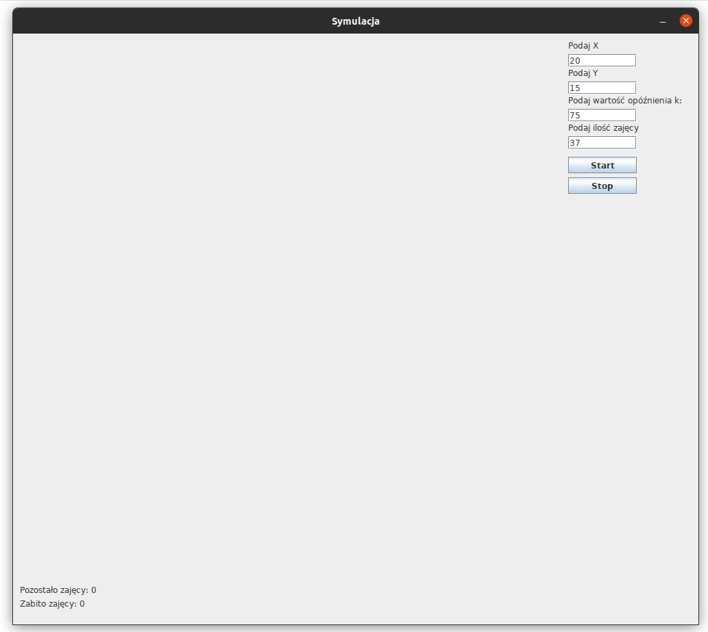
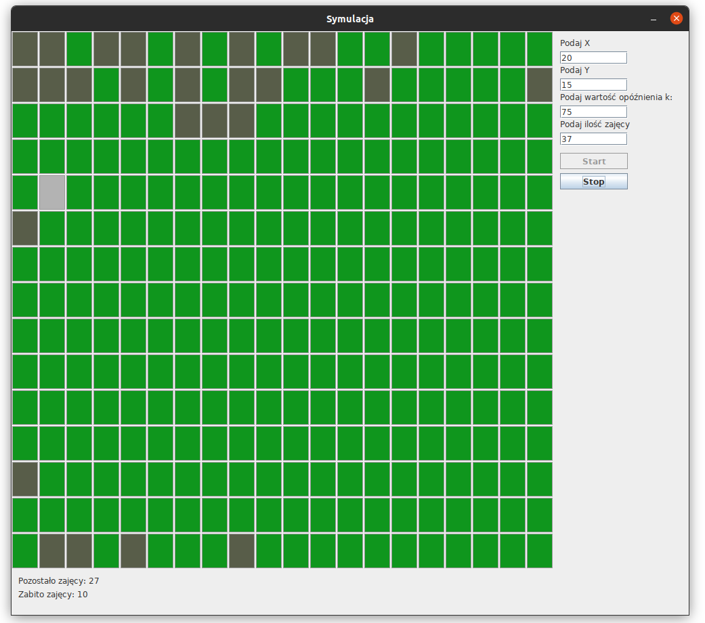
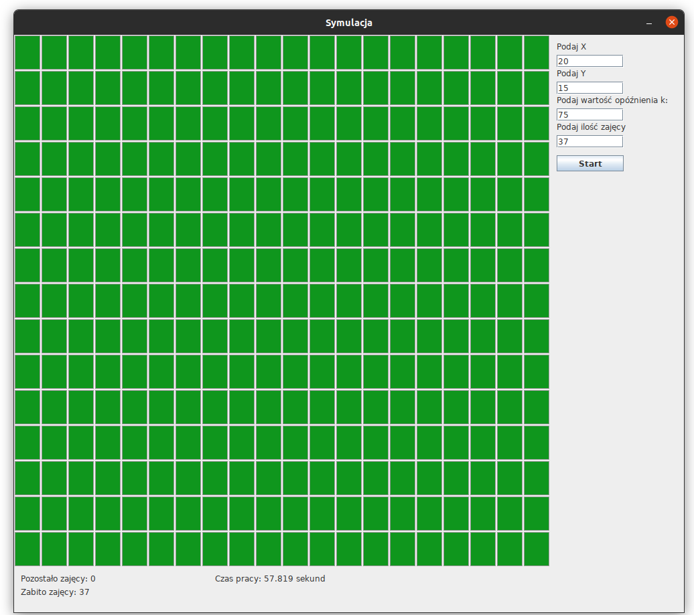

## Table of contents
* [Technologies](#technologies)
* [General info](#general-info)
* [Application description](#application-description)
	

## Technologies

 

## General info
Projekt studencki na zajęcia z Kursu Programowania.
Tworzony przez [Maciej Lewandowicz](https://github.com/sasuke5055).

## Application description
Celem zadania było opanowanie pracy wielowątkowej w Javie. Zadanie polegało na napisaniu symulacji 'Wilk i zające', 
w której zwierzęta poruszają się po planszy o jedno pole w każdym ruchu. Zające mają za zadanie uciekać przed wilkiem. 
Każde ze zwierząt porusza się z zadanym opóźnieniem z zakresu <-k,k>. 

Każdy zając reperezentuje tu jeden wątek. Kiedy zostaje złapany przez wilka, wątek jest usypiany i niszczony. 
Symulacja kończy się, gdy wilk unicestwi wszystkie zające.

Użytkownik może podać w parametrach wielkośc planszy (x,y), ilośc zajęcy i opóźnienie k.

Po zakończeniu symulacji prezentowane jest podsumowanie z czasem trwania całej symulacji. 

